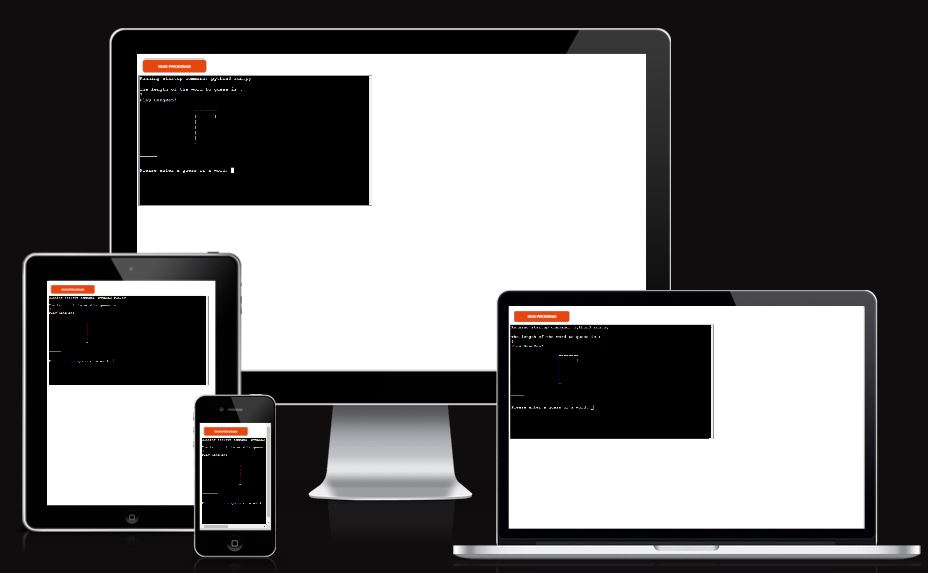
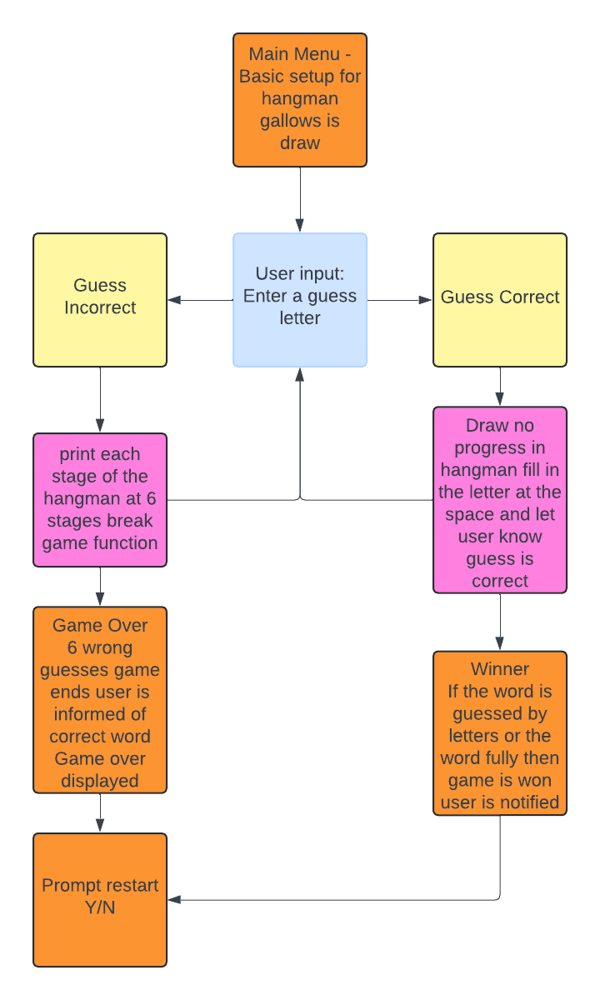
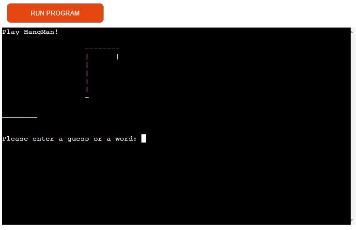
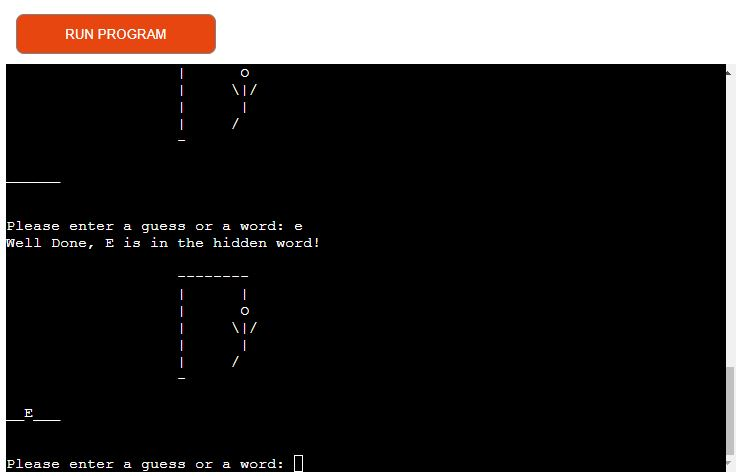
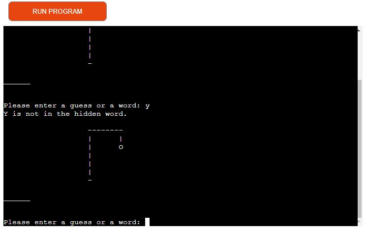
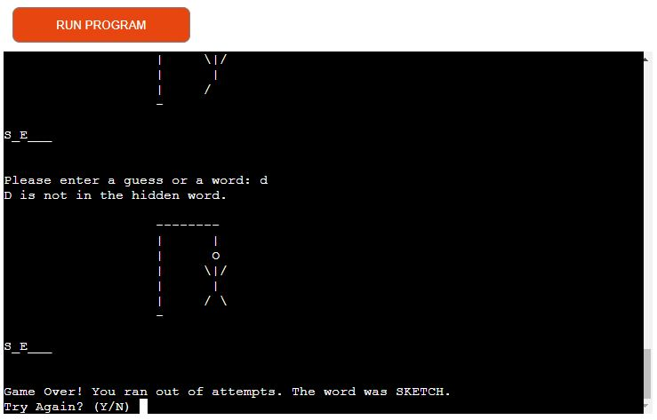
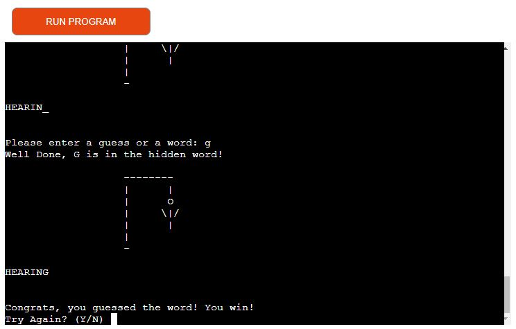
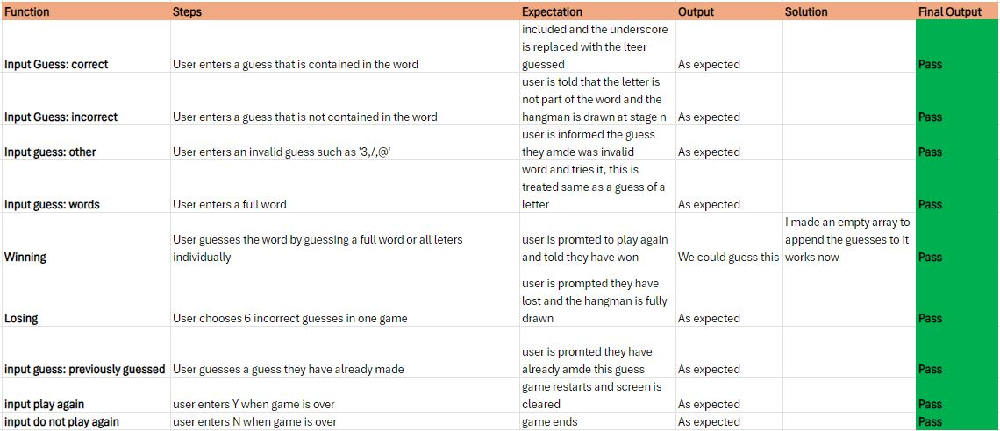

# HangMan Game

This is a project based on the classic hangman game using words chosen at random by the import random module in python, I learnt alot in this project and had some good fun overcoming challenges whilst building it.

* The GitHub repository for this project can be found here https://github.com/RourkeW/hangmanPP3
* The project has been deployed on heroku, this can be found here https://hangmanpp3rw-07abbe2bff2a.herokuapp.com/

## How to play 
1. The game is set up by drawing empty gallows and the player is asked to guess the word or letter.
2. The player inputs a guess being a letter or a word(e.g. "A" or "E") I included a clause to detect if the word or letter has been guessed in the playthough so the user cannot make the same guess by mistake.
3. In classic hangman you have 6 incorrect guesses before the game is lost, I have chosen this approach too.
4. If a player guesses incorrectly then part of the hangman is drawn, (head, head and torso, head, torso and one arm, head torso, and both arms, head, torso, both arms and one leg and finally head, torso, botha rms and both legs(I did this using ascii and a array to redraw the hangman each time)
5. if the player makes a correct guess then the missing space filled with an underscore is filled in and theya re not penalised. 
6. If the player reaches 6 incorrect guesses then the game will end witha  game over message and there will be a prompt to restart the game and the user is informed of the word that was to be guessed.
7. If the player manages to guess the word by letter or the full word then a message will display to let them that they have won and there will be a prompt to restart the game, I did not make it so words are remove from the wordpool because I thought its better this way.

## Design of the game

I really liked using this Lucid chart website to create my plan for the game, I saw it being used in the love-sandwiches walkthrough project and thought I would use it in my own planning.

## Features

### The Game
1. The game showing a prompt to enter a letter and the basic gallows drawn

### Play game - Correct Guess
1. The user enters a guess that is included in the word, the letter is drawn the hangman is not drawn and the user cannot make this guess again

### Play game - Incorrect Guess
1. The user enters a guess that is not included in the word, the hangman is drawn partially and the guess cannot be made again

### Play Game - Invalid Guess
1. This code detects whether a user has entered a partial word, or a number or special character, these are not accepted in the program so a message is displayed

### Play Game - Game Over
1. If the player makes 6 wrong guesses then the hangman will be fully drawn and the game will prompt a loss message and then another promt to restart

### Play Game - Winner!

## Future features 

1. I would like to be able to make a multiplayer version since I think the game is more enjoyable when you make the word yourself and someone else guesses it.
2. I would also like to try and impliment a online WordAPI toi choose the words, rright now the game words from an imported py file within the directory that pulls a random word from a list. However my tutor Luke asked me to look into a word API as this would involve way more than 300 words. I tried this one https://random-word-api.herokuapp.com/home and I used the call to the API https://random-word-api.herokuapp.com/word?length=6 to constantly generate a new 6 letter word, you can also use a range. However I was very surprised by the complexity of the words coming back to me since I did not recognise any of them and it made me doubt my knowledge of english. even limiting the API to only support the lang="en" I could not recognise alot of the words.

# Technologies

* The game is completely written in Python.
* The IDE used was GitPod using the Code Institute template.
* Heroku was used to deploy the project.
* GitPod has been used to regularly adding, committing and pushing code to GitHub.
* All code and assets have been stored at GitHub.

# Testing
Throughout this project I have been testing the game by running it in the Terminal. 

## Solved bugs
1. I had to make sure that the program would not accept the same word twice, I used an array to append guesses each time one is amde, and then if this is guessed again a message reminding the user that the guess was already made is displayed.
2. I had an issue when first creatying the hangman that a bunch of value errors would show since it did not like a backslash being next to a quotation mark, I played with this and found if I put another backslash there it would not be an issue anymore an dowuld not show up twice on the ahngman.
3. clear screen- I ahve a clear screen function to clear the screen each time a new game is being played
4. I ahd to amke sure you could not guess non character letters or words, I did this using the .isalpha() method on any guesses made, I also used .upper() to make sure everything is better read so if a guess is made in lower case it will be displayed in upper case

## Validator Testing

# Deployment

## Adding, committing and pushing code
- I pushed all my code to the repository https://github.com/RourkeW/hangmanPP3
- All code here has been commited regulary and pushed atleast once daily throughout the making of the project.
- The commands used to do this are:
- 'git add .', 'git commit -m "feat: commit message" and ffinally 'git push'

## Deploying to Heroku
I deployed my project directly to Heroku by doing the following:

1. Created the account on Heroku.com following the walkthrough project.
2. I added my own personal billing information but it does not matter since we get a free 5 project limit
3. Clicked on "Create new app" and named it hangmanpp3rw, it is long because they have to be unique compared to all users on heroku
4. Clicked on Settings and added Backpacks - Python and Node.js.
5. Made sure the backpacks were in the right order.
6. Connected my GitHub profile and found the right Repository.
7. Manually deployed the page and clicked "Eanble automatic deploys" at the same time.

# Credits 
1. I was inspired by [Shaun Halverson, PythonHangman](https://github.com/ShaunHalverson/PythonHangman).
2. Simplistic code and functionality has been inspired from [Shaun Halverson,How To Code Hangman In Python | Tutorial For Beginners](https://www.youtube.com/watch?v=pFvSb7cb_Us&t=723s)
3. I used some of the idea's Shaun presented here but ultimately tooka  different approach, I did however use the drawing of the hangman from him.
4. As usual a great deal of research into ideas and troubleshooting on [Stack Overflow](https://stackoverflow.com/), [W3 Schools](https://www.w3schools.com/) and a new website I like called [Geeks for Geeks](https://www.geeksforgeeks.org/)

# Acknowledgement
1. As usual big thanks to my mentor Luke who had some great ideas and was quick to the rescue when I would ask questions and raise minor problems in mentor meetings.
